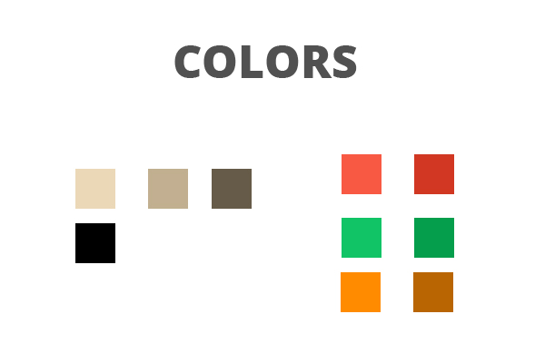
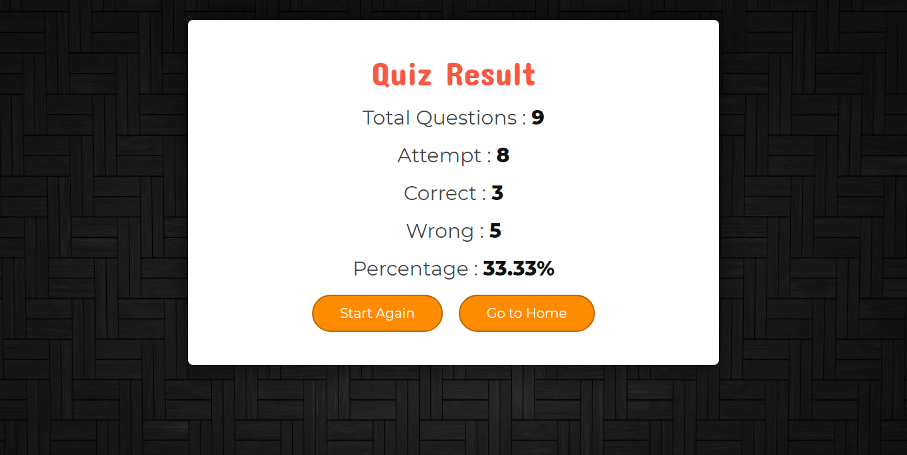

This program is used html,css, and javascript.
It is a wonderful Quiz program and we can see the score, timer and description as well and I used poweful features of css and javaScript.
I declared an array of object with question and option include in it.
I generated the function accordingly.
Here used add, remove and innerHTML, eventlistners etc.
For loops and If embedded here to make it more userfriendly program.
Because of the timer the user will be aware of the faster action other wise they are going to loose the game.
I made HTML simple so that we can use the properties of javaScript in the higher level.
This is my beautiful quiz application

 https://dhanya-krishnan2.github.io/quizapplication/.
 
 and I am adding the screen shots as well
 
 
 
 
 
 
.png)

.png)

.png)

.png)

.png)
The user  will get only 15sec to submit the answer and if they fail to submit the answer they miss the chance to submit it and they will finally know the highest score they will get in their each attempt.
